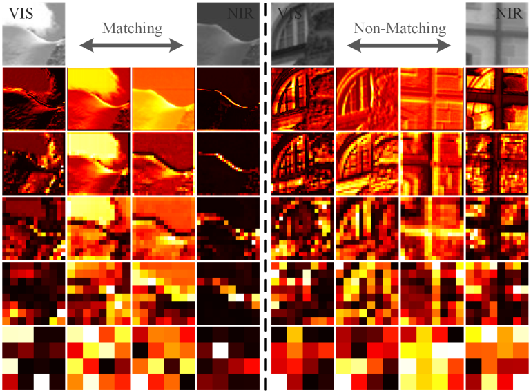

## The official complete code for paper "Relational Representation Learning Network for Cross-Spectral Image Patch Matching" [[Paper/arXiv](https://arxiv.org/abs/2403.11751)] [Accepted by Information Fusion]  
In this open source project, we integrate multiple cross-spectral image patch matching networks ([**SCFDM**](https://link.springer.com/chapter/10.1007/978-3-030-20890-5_8), [**AFD-Net**](https://openaccess.thecvf.com/content_ICCV_2019/papers/Quan_AFD-Net_Aggregated_Feature_Difference_Learning_for_Cross-Spectral_Image_Patch_Matching_ICCV_2019_paper.pdf), [**MFD-Net**](https://ieeexplore.ieee.org/document/9777946), [**EFR-Net**](https://ieeexplore.ieee.org/document/10164118), [**FIL-Net**](https://ieeexplore.ieee.org/document/10251126), [**RRL-Net**](https://arxiv.org/abs/2403.11751)) and multiple cross-spectral image patch matching datasets ([**VIS-NIR patch dataset**](https://ieeexplore.ieee.org/document/5995637), [**OS patch dataset**](https://ieeexplore.ieee.org/document/10164118), [**SEN1-2 patch dataset**](https://ieeexplore.ieee.org/document/10251126)). We hope we can contribute to the development of this field. Everyone is welcome to use it.

<p align="center">
  <br>  
</p> 

Existing methods focus on extracting diverse feature relations and ignore individual intrinsic features. However, sufficient representation of the individual intrinsic features is the basis for subsequent mining of feature relations. Therefore, our relational representation learning focuses on fully mining two aspects: the intrinsic features of individual image patches and the relations between image patch features.


## Datasets
1. Original datasets
* **VIS-NIR patch dataset** [[Link1](https://ieeexplore.ieee.org/document/7789530)] [[Link2](https://ieeexplore.ieee.org/document/5995637)]
* **OS patch dataset** [[Link1](https://ieeexplore.ieee.org/document/10164118)] [[Link2](https://ieeexplore.ieee.org/document/9204802)]
* **SEN1-2 patch dataset** [[Link1](https://ieeexplore.ieee.org/abstract/document/10251126)] [[Link2](https://arxiv.org/abs/1906.07789)]
  
2. The datasets we created from original datasets (**can be used directly in our demo**)
* 💎 Download the dataset required by our code!!! ([1.VIS-NIR](https://pan.baidu.com/s/1Bg2M2U1pr5lw4DbWYb0kCQ?pwd=1234); [2.OS](https://pan.baidu.com/s/1Ig2q3p7KL2VH26dH4jddfQ?pwd=1234); [3.SEN1-2](https://pan.baidu.com/s/13X3c4SXKE3oU--W_7WmlEg?pwd=1234))


## How to use our code
1. Download the dataset.
   
&nbsp;&nbsp;&nbsp;&nbsp;&nbsp;&nbsp;&nbsp;&nbsp;Click ([1.VIS-NIR](https://pan.baidu.com/s/1Bg2M2U1pr5lw4DbWYb0kCQ?pwd=1234); [2.OS](https://pan.baidu.com/s/1Ig2q3p7KL2VH26dH4jddfQ?pwd=1234); [3.SEN1-2](https://pan.baidu.com/s/13X3c4SXKE3oU--W_7WmlEg?pwd=1234))
  

&nbsp;&nbsp;&nbsp;&nbsp;&nbsp;&nbsp;&nbsp;&nbsp;Unzip the downloaded compressed package into the newly created "data" folder under root directory of the project.

2. Creat a Anaconda Virtual Environment.  
   ```
    conda create -n RRL-Net python=3.6 
    conda activate RRL-Net 
   ```

3. Configure the running environment. (One of the configurations can be used.)
   * **Configure 1: CUDA10.0**
   ```
    conda install cudatoolkit==10.0.130
    conda install cudnn
    pip install keras==2.2.5 -i https://pypi.tuna.tsinghua.edu.cn/simple
    pip install tensorflow-gpu==1.14.0 -i https://pypi.tuna.tsinghua.edu.cn/simple
    pip install scikit-learn==0.24.1  -i https://pypi.tuna.tsinghua.edu.cn/simple
    pip install scikit-image==0.17.2  -i https://pypi.tuna.tsinghua.edu.cn/simple
    pip install matplotlib==3.3.4  -i https://pypi.tuna.tsinghua.edu.cn/simple
    pip install opencv-python==4.5.1.48 -i https://pypi.tuna.tsinghua.edu.cn/simple
    pip install opencv-python-headless==4.5.1.48 -i https://pypi.tuna.tsinghua.edu.cn/simple
    pip install imgaug==0.4.0  -i https://pypi.tuna.tsinghua.edu.cn/simple
   ```
   * **Configure 2: CUDA11.0**
   ```
    pip install keras==2.3.1 -i https://pypi.tuna.tsinghua.edu.cn/simple
    pip install nvidia-tensorflow==1.15.4+nv20.10  -i https://pypi.tuna.tsinghua.edu.cn/simple
    pip install imgaug==0.4.0 -i https://pypi.tuna.tsinghua.edu.cn/simple
    pip install scikit-learn==0.24.2 -i https://pypi.tuna.tsinghua.edu.cn/simple
   ```
4. Training the model.  
   * **Choose 1:**  **--dataset** in ['VIS-NIR', 'OS', 'SEN1-2']; **--model** in ['SCFDM', 'AFD', 'MFD', 'EFR', 'FIL', 'RRL']
    ```
    python train_model_new.py  --learning_rate 2e-4  --batch_size 64  --epochs 40  --dataset 'VIS-NIR'  --model 'RRL'
    ```
   * **Choose 2:**
    ```
    python train_model.py   ## The default model and dataset are the **RRL-Net** and the **VIS-NIR patch dataset**. You can modify the default setting directly.
    ```

5. Testing the Model.  
     
    * **Choose 1:**  **--dataset** in ['VIS-NIR', 'OS', 'SEN1-2']; **--model** in ['SCFDM', 'AFD', 'MFD', 'EFR', 'FIL', 'RRL']
    ```
    python test_model_new.py  --batch_size 64  --dataset 'VIS-NIR'  --model 'RRL'
    ```
    * **Choose 2:**
    ```
    python test_model.py  ## The default model and dataset are the **RRL-Net** and the **VIS-NIR patch dataset**. You can modify the default setting directly.
    ```

## Results

* **Quantative Results on the VIS-NIR patch dataset**:
<p align="center">
  <span align="center"> 
  
</p>

* **Quantative Results on the OS patch dataset**:
<p align="center">
  <span align="center">
  
</p>

* **Quantative Results on the SEN1-2 patch dataset**:
<p align="center">
  <span align="center">  
  
</p>

* **Qualitative Results on the VIS-NIR cross-spectral scenarios**:
<p align="center">
  <span align="center">  
  
</p>
<div align="center">
From top to bottom, the four lines of samples are misjudged as non-matching, misjudged as matching, correctly judged as non-matching, and correctly judged as matching.
</div><br>

* **Qualitative Results on the VIS-SAR cross-spectral scenarios**:
<p align="center">
  <span align="center">  
  
</p>
<div align="center">
The left and right sides of the arrows denote the true labels and predicted results, respectively.
</div><br>

* **Visualization of feature maps**:
<p align="center">
  <span align="center">  
  
</p>
<div align="center">
For each pair of samples, the middle two columns denote the output of the MGLA module at each stage, and the left and right columns denote the private feature maps output by the FIL module at each stage. From top to bottom, they denote the stages from shallow to deep.
</div><br>


## Citation

If you find this repo helpful, please give us a 🤩**star**🤩. Please consider citing the **RRL-Net** if it benefits your project. <br>  

BibTeX reference is as follows:
```
@misc{yu2024relationalrepresentationlearningnetwork,
      title={Relational Representation Learning Network for Cross-Spectral Image Patch Matching}, 
      author={Chuang Yu and Yunpeng Liu and Jinmiao Zhao and Dou Quan and Zelin Shi},
      year={2024},
      eprint={2403.11751},
      archivePrefix={arXiv},
      primaryClass={cs.CV},
      url={https://arxiv.org/abs/2403.11751}, 
}
```

word reference is as follows:
```
Chuang Yu, Yunpeng Liu, Jinmiao Zhao, Dou Quan and Zelin Shi. Relational Representation Learning Network for Cross-Spectral Image Patch Matching. arXiv preprint arXiv:2403.11751, 2024.
```

## Other link

1. My homepage: [[YuChuang](https://github.com/YuChuang1205)]
2. KGL-Net: [[demo](https://github.com/YuChuang1205/KGL-Net)]


